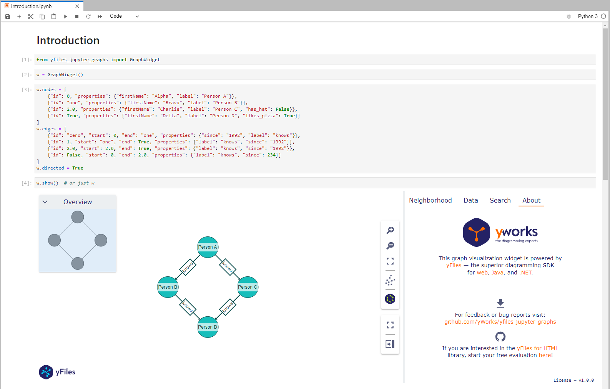
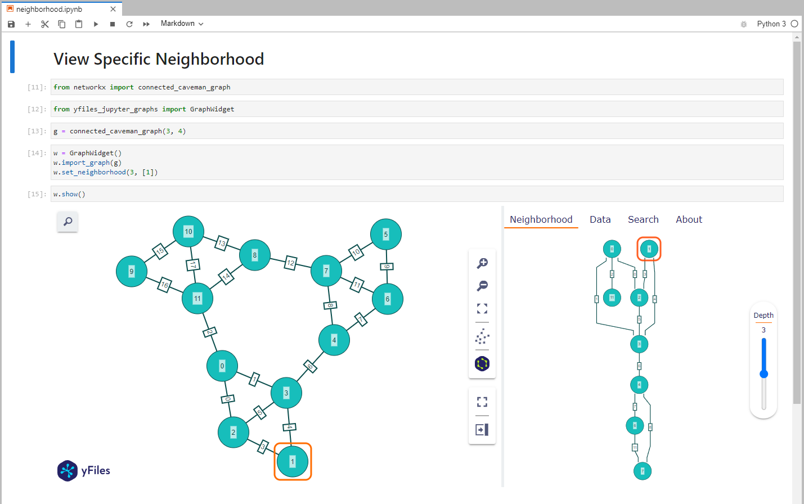
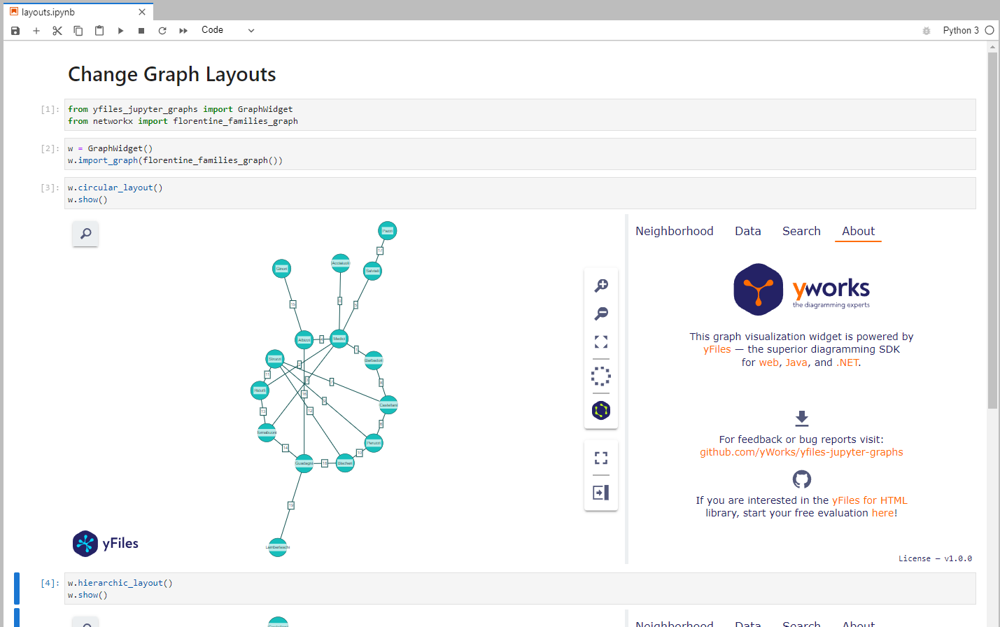
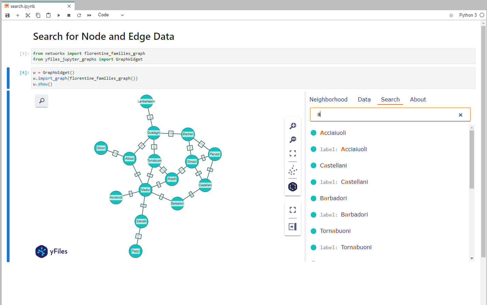
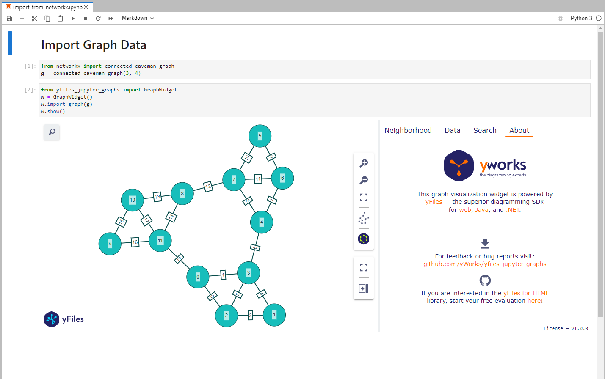

<p align="center">
    
</p>

# yFiles Jupyter Graphs

[](https://badge.fury.io/py/yfiles-jupyter-graphs)

A graph diagram visualization widget for Jupyter Notebooks and Labs powered by [yFiles for HTML](https://www.yworks.com/yfiles-overview?utm_campaign=yfiles4jupyter&utm_source=github&utm_medium=readme).



## Requirements
- [python](https://www.python.org/) >= 3.6
- [jupyter](https://jupyter.org/install) notebook or lab
- [ipywidgets](https://github.com/jupyter-widgets/ipywidgets) >= 7.6.0

## Installation

Install the prebuilt extension from the [Python Package Index](https://pypi.org/).

```bash
pip install yfiles_jupyter_graphs
```

## Usage
```python
"""Execute in jupyter notebook or jupyter lab"""
from yfiles_jupyter_graphs import GraphWidget
# shows empty widget
GraphWidget()
```

You can find the full documentation [here](https://github.com/yWorks/yfiles-jupyter-graphs/wiki/Documentation).

## Features
<table>
    <tr>
        <td><a href="examples/neighborhood.ipynb"></a>
        <a href="examples/neighborhood.ipynb">See Node Neighborhood</a></td>
        <td><a href="examples/layouts.ipynb"></a>
        <a href="examples/layouts.ipynb">Choose Graph Layout</a></td>
    </tr>
    <tr>
        <td><a href="examples/sidebar.ipynb"></a>
        <a href="examples/sidebar.ipynb">Investigate Nodes or Edges Data</a></td>
        <td><a href="examples/sidebar.ipynb"></a>
        <a href="examples/sidebar.ipynb">Search for Nodes or Edges</a></td>
    </tr>
    <tr>
        <td><a href="examples/import_from_networkx.ipynb"></a>
        <a href="examples/import_from_networkx.ipynb">Import Graph Data</a></td>
        <td><a href="examples/element_color_mapping.ipynb"></a>
        <a href="examples/element_color_mapping.ipynb">Make Data Dependent Property Changes</a></td>
    </tr>
</table>

For example code look [here](https://github.com/yWorks/yfiles-jupyter-graphs/tree/master/examples).

## Documentation
You can find the documentation [here](https://github.com/yWorks/yfiles-jupyter-graphs/wiki/Documentation).

## Code of Conduct
This project and everyone participating in it is governed by the [Code of Conduct](https://github.com/yWorks/yfiles-jupyter-graphs/blob/master/CODE_OF_CONDUCT.md).
By participating, you are expected to uphold this code.
Please report unacceptable behavior to [contact@yworks.com](mailto:contact@yworks.com).

## Feedback
This widget is by no means perfect. 
If you find something is not working as expected 
we are glad to receive an issue report from you. 
Please make sure to [search for existing issues](https://github.com/yWorks/yfiles-jupyter-graphs/search?q=is%3Aissue+repo%3AyWorks%2Fyfiles-jupyter-graphs&type=issues) first 
and check if the issue is not an unsupported feature or known issue.
If you did not find anything related, report a new issue with necessary information.
Please also provide a clear and descriptive title and stick to the issue templates.
See [issues](https://github.com/yWorks/yfiles-jupyter-graphs/issues).

## Dependencies
- [@jupyter-widgets/base](https://github.com/jupyter-widgets/ipywidgets)
- [@mdi/js](https://github.com/Templarian/MaterialDesign-JS)
- [json-viewer-js](https://github.com/renhongl/json-viewer-js)

## License
See [LICENSE](LICENSE.md) file.
